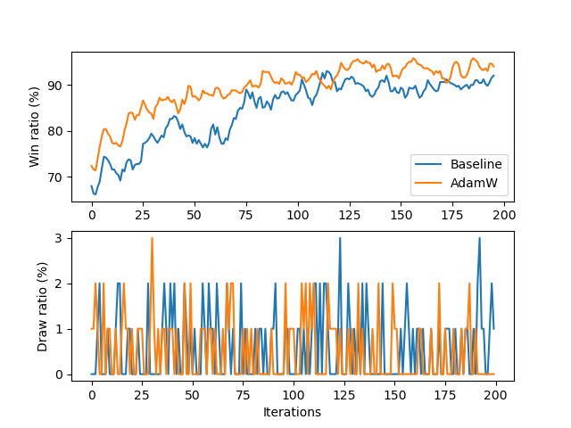
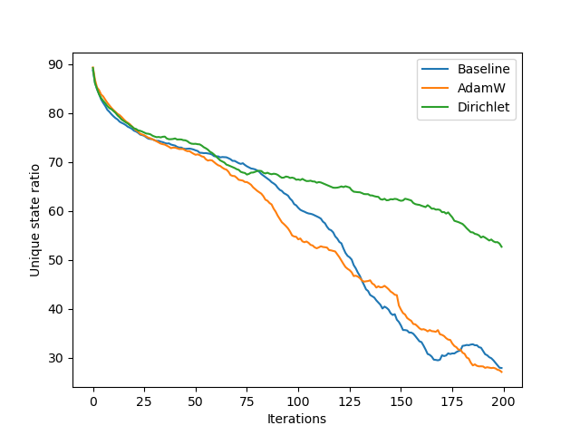
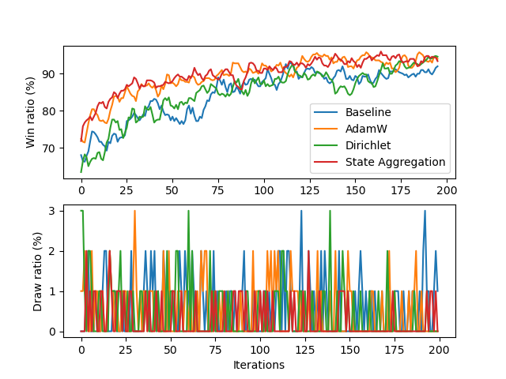
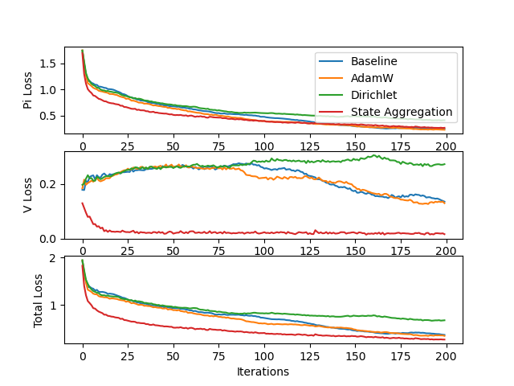
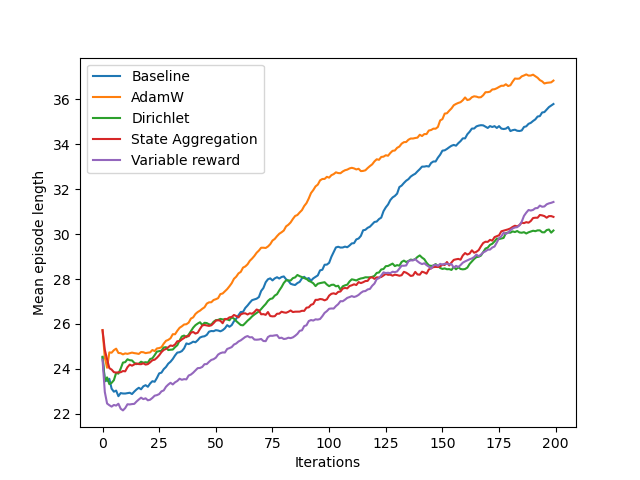
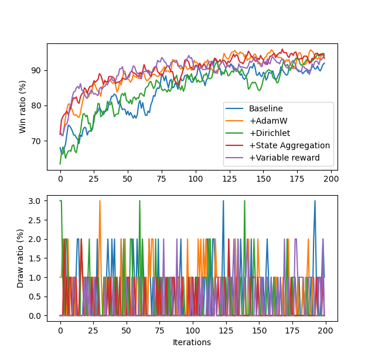

# AlphaZero-Connect4
This mini project explores [AlphaZero](https://arxiv.org/pdf/1712.01815.pdf) framework with several simple extensions on top of it using Connect4 game as the use case.

## Dependencies:
- pytorch 1.7.1
- gym 0.18.0
- gym_connect4 0.8

## Basics and the baseline architecture
AlphaZero is a model-based reinforcement learning framework where the policy is implemented as a deep neural network and Monte Carlo Tree Search (MCTS) is used as the environment model. In the setting of the Connect4 game, the policy network maps board states to action probabilites (i.e. which action is more likely to lead to win?) and expected reward from the current state (i.e. value of the state). Typically one training iteration consists of a game played out. At each step of the game, a number of MCTS simulations are rolled out starting from the current state of the game (root node). At each simulation step (i.e. at each node of the tree), a vector of action probabilites for the current node is sampled from the network. Action from the current node is selected as a function of the action probability vector and the visiting counts of the child nodes (more precisely, using Upper Confidence Bound). When the simulations are finished, the action that is sampled most from the root node is selected and played in the game. This yields the next state and an outcome (i.e. reward, -1 for loss, 1 for win, 0 otherwise) and eventually a sample that is composed of the original state, action probabilites and outcome. Samples collected from every step of the game are used in the training of the network as input (state) and target (action probabilities and outcomes) values. During the play/test either the network is used in a stand-alone fashion or in combination with MCTS, as in the training process.  

This work uses [this](https://github.com/suragnair/alpha-zero-general) code base as the starting point and explores various extensions to improve certain aspects of the framework. For monitoring the evolution, a simple One-Step Look Ahead agent is implemented and pit against the AlphaZero agent. 100 games are played (first player positions are divided as 50-50) after each training iteration, win and draw rates are used as performance metrics. The plots show smoothed version of these values with a moving average of 5 iterations. The performance of the baseline framework is shown in the figure below.

 

The baseline framework uses Adam optimizer without weight decay.

## Weight regularization
The original [AlphaZero paper](https://arxiv.org/pdf/1712.01815.pdf) formulates the loss function with weight regularization. To see the effect of this, we can use AdamW optimizer and compare the results:

 

As we can see, weight regularization results in a boost in the performance.

## Dirichlet noise
If we analyze the states visited during the training phase, we will notice that the number of unique states diminishes over time. This is normal since as the network learns a winning policy, it will exploit it to win the games. This will increase the frequency of certain states, which the network thinks the most advantageous, and some other states may not be visited at all. This exploiting behaviour pattern can be dangerous especially in the beginning of the training since the network might find a sub-optimal policy and stay there. To encourage exploration, the authors of the original [AlphaZero paper](https://arxiv.org/pdf/1712.01815.pdf) propose to add Dirichlet noise to the action probabilities at the root node of every MCTS run. Figures below show the impact of this in the Connect4 setting:

 
 

The ratio of unique states stays higher than the baseline and AdamW cases indicating that the system still explores other states. However, this comes with an expense of slight performance drop (note that Dirichlet noise is turned of during testing). In a game like Connect4 where the complexity of the state space is relatively low, initial randomness of the network weights might induce enough exploration to find an optimal policy. The impact of Dirichlet noise is more prominent in games like Chess or Go.  

## State aggregation
The decrease of unique states over time reveals an interesting fact: as training progresses the network is being trained with more similar states. However, the variance in the target values of these states may cripple the training progress. As proposed [here](https://medium.com/oracledevs/lessons-from-alpha-zero-part-6-hyperparameter-tuning-b1cfcbe4ca9a) we can average the target values seen for each state to help the network learn faster:

 

First, sanity check: the total number of samples in the buffer is minimum in the long run (steady increase until iteration 20 is due to the size of the sample buffer which is set to 20 iterations).

 
 

As we can see from the loss function, the network learns much faster and we get the best performance by a small margin.

## Variable reward
As we analyze the training data more, we can also see that the average game length is increasing with the training time. This indicates that the policy being learned favors longer games. How can we impose network to win as soon as possible?  Instead of {-1, 1} reward scheme, we can weight the reward proportional to the 1/game length, as also done in [this article](https://medium.com/oracledevs/lessons-from-alphazero-connect-four-e4a0ae82af68):

 

With this setting, we achieve reducing average game length.

## Conclusions
Here are all the results put together:

 
 

